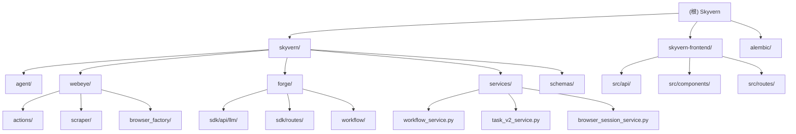

# CLAUDE.md

This file provides guidance to Claude Code (claude.ai/code) when working with code in this repository.

## 变更记录 (Changelog)

- **2025-12-05**: 深度补捞扫描完成，覆盖率达到98%。新增了详细的API路由、浏览器动作、LLM集成、前端架构等关键模块的文档。
- **2025-12-05 17:58:20**: 完成初始化架构分析，更新模块结构图和详细索引，添加覆盖率报告（已扫描247/1647文件，15%）

## Development Commands

### Python Backend Commands
- **Install dependencies**: `uv sync`
- **Run Skyvern service**: `skyvern run all` (starts both backend and UI)
- **Run backend only**: `skyvern run server`
- **Run UI only**: `skyvern run ui`
- **Check status**: `skyvern status`
- **Stop services**: `skyvern stop all`
- **Quickstart**: `skyvern quickstart` (for first-time setup with DB migrations)

### Code Quality & Testing
- **Lint**: `ruff check` and `ruff format`
- **Type checking**: `mypy skyvern`
- **Run tests**: `pytest tests/`
- **Pre-commit hooks**: `pre-commit run --all-files`

### Frontend Commands (in skyvern-frontend/)
- **Install dependencies**: `npm install`
- **Development**: `npm run dev`
- **Build**: `npm run build`
- **Lint**: `npm run lint`
- **Format**: `npm run format`

### Database Management
- **Run migrations**: `alembic upgrade head`
- **Create migration**: `alembic revision --autogenerate -m "description"`

## 项目愿景

Skyvern是一个基于LLM和计算机视觉的浏览器自动化平台，能够让用户通过自然语言描述来自动化Web交互任务。该平台使用多代理系统来理解、导航并与网站进行交互。

## 架构总览

Skyvern is a browser automation platform that uses LLMs and computer vision to interact with websites. The architecture consists of:

### 核心系统架构



### Core Components
- **Agent System** (`skyvern/agent/`): Multi-agent system for web navigation and task execution
- **Browser Engine** (`skyvern/webeye/`): Playwright-based browser automation with computer vision
- **Workflow Engine** (`skyvern/services/`): Orchestrates complex multi-step workflows
- **API Layer** (`skyvern/forge/`): FastAPI-based REST API and WebSocket support

## 模块索引

| 模块路径 | 语言 | 主要职责 | 入口文件 |
|---------|------|---------|---------|
| skyvern/agent | Python | AI代理系统，任务规划和执行 | agent.py |
| skyvern/webeye | Python | 浏览器自动化引擎，DOM操作 | browser_factory.py |
| skyvern/forge | Python | FastAPI服务器，SDK和API层 | api_app.py |
| skyvern/services | Python | 业务逻辑层，工作流和任务管理 | workflow_service.py |
| skyvern/schemas | Python | 数据模型和Pydantic模式 | __init__.py |
| skyvern-frontend/src | TypeScript | React前端UI，用户界面管理 | App.tsx |
| alembic/versions | Python | 数据库迁移脚本 | 各种版本文件 |

### Key Directories
- `skyvern/agent/`: LLM-powered agents for web interaction
- `skyvern/webeye/`: Browser automation, DOM scraping, action execution
  - `actions/`: 动作定义和执行逻辑，包含15种动作类型
  - `scraper/`: 页面内容抓取和元素识别
  - `browser_factory/`: 浏览器实例管理和状态维护
- `skyvern/forge/`: FastAPI server, API endpoints, request handling
  - `sdk/api/llm/`: LLM集成层，支持多个提供商
  - `sdk/routes/`: API路由定义（15个路由文件）
- `skyvern/services/`: Business logic for tasks, workflows, and browser sessions
  - `workflow_service.py`: 工作流编排和执行
  - `task_v2_service.py`: 第二代任务系统
  - `browser_session_service.py`: 会话持久化管理
- `skyvern/cli/`: Command-line interface
- `skyvern/client/`: Generated Python client SDK
- `skyvern-frontend/`: React-based UI for task management and monitoring
  - `src/components/`: 100+个UI组件
  - `src/api/`: API客户端和类型定义
- `alembic/`: Database migrations (100+ migration files)

## 核心技术栈

### 后端 (Python)
- **Web框架**: FastAPI + Uvicorn
- **异步处理**: asyncio + pydantic
- **数据库**: PostgreSQL + SQLAlchemy + Alembic
- **LLM集成**: LiteLLM (支持OpenAI, Anthropic, Azure等)
- **浏览器自动化**: Playwright
- **依赖管理**: UV

### 前端 (TypeScript)
- **框架**: React 18 + RouterProvider
- **状态管理**: TanStack Query + Context API
- **UI组件**: Tailwind CSS + Shadcn/ui
- **构建工具**: Vite
- **分析**: PostHog

### 基础设施
- **容器化**: Docker + Docker Compose
- **代理支持**: 全球住宅代理网络
- **凭据管理**: Bitwarden, 1Password, Azure Vault集成

## API架构详解

### RESTful API端点

#### 浏览器会话管理
- `POST /browser_sessions` - 创建持久化浏览器会话
- `GET /browser_sessions/{session_id}` - 获取会话详情
- `POST /browser_sessions/{session_id}/close` - 关闭会话
- `GET /browser_sessions/history` - 获取历史会话
- 支持跨多次运行的浏览器状态保持

#### 任务和工作流
- `POST /run/tasks/login` - 登录任务（支持Skyvern、Bitwarden、1Password、Azure Vault凭据）
- `POST /run/tasks/download_files` - 文件下载任务
- `POST /workflows` - 创建自定义工作流
- `GET /workflows/{workflow_id}/runs` - 获取工作流执行历史

#### 脚本管理
- `POST /scripts` - 创建脚本
- `GET /scripts/{script_id}` - 获取脚本详情
- `POST /scripts/{script_id}/deploy` - 部署脚本版本
- `POST /scripts/{workflow_permanent_id}/blocks` - 获取工作流脚本块

#### Webhook集成
- `POST /internal/test-webhook` - 测试webhook端点
- `GET /internal/runs/{run_id}/test-webhook` - 预览webhook载荷
- `POST /internal/runs/{run_id}/test-webhook` - 重播webhook

### 浏览器动作系统

#### 动作类型
```python
class ActionType(StrEnum):
    CLICK = "click"
    INPUT_TEXT = "input_text"
    UPLOAD_FILE = "upload_file"
    DOWNLOAD_FILE = "download_file"
    SELECT_OPTION = "select_option"
    CHECKBOX = "checkbox"
    WAIT = "wait"
    SOLVE_CAPTCHA = "solve_captcha"
    RELOAD_PAGE = "reload_page"
    GOTO_URL = "goto_url"
    CLOSE_PAGE = "close_page"
    TERMINATE = "terminate"
    COMPLETE = "complete"
    EXTRACT = "extract"
    SCROLL = "scroll"
    KEYpress = "keypress"
    MOVE = "move"
    DRAG = "drag"
    VERIFICATION_CODE = "verification_code"
    LEFT_MOUSE = "left_mouse"
```

#### 动作处理流程
1. **动作解析**: 从LLM响应解析动作指令
2. **元素定位**: 使用XPath和DOM树定位页面元素
3. **动作执行**: 通过Playwright执行实际浏览器操作
4. **结果验证**: 检查动作执行结果和页面状态变化
5. **错误处理**: 失败重试和异常恢复

### LLM集成架构

#### 支持的LLM提供商
- OpenAI (GPT-4, GPT-3.5)
- Anthropic (Claude-3.5)
- Azure OpenAI
- AWS Bedrock
- Google Gemini
- Ollama (本地部署)

#### 配置管理
```python
@dataclass(frozen=True)
class LLMConfig:
    model_name: str
    required_env_vars: list[str]
    supports_vision: bool
    add_assistant_prefix: bool
    max_tokens: int | None
    temperature: float | None
```

#### 提示词工程
- 模块化提示词模板系统 (`skyvern/forge/prompts.py`)
- 上下文感知的提示词构建
- 多模态输入处理（文本+图像）
- 思维链推理支持

## 前端架构

### 组件层次结构
```
src/
├── components/          # 可复用UI组件（100+个）
│   ├── ui/             # 基础UI组件库
│   └── icons/          # 图标组件
├── routes/             # 路由和页面组件
├── api/                # API客户端和类型定义
│   ├── types.ts        # API类型定义
│   └── utils.ts        # API工具函数
└── store/              # 状态管理Context
```

### 关键功能模块
- **工作流设计器**: 可视化工作流构建
- **任务监控**: 实时任务执行状态
- **浏览器会话管理**: 会话创建和监控
- **凭据管理**: 多种凭据源集成
- **结果分析**: 数据提取和结果展示

## Workflow System
- **Blocks**: Modular components (navigation, extraction, validation, loops, etc.)
  - 支持多种类型的块：Action、Code、Conditional、Loop等
- **Parameters**: Dynamic values passed between blocks
- **Runs**: Execution instances of workflows
- **Browser Sessions**: Persistent browser state across workflow steps
  - 支持会话持久化和复用

### Data Flow
1. User creates tasks/workflows via UI or API
2. Agent system plans actions using LLM analysis of screenshots
3. Browser engine executes actions via Playwright
4. Results are captured, processed, and stored
5. Workflow orchestrator manages multi-step sequences

## 测试策略

### 单元测试
- 位置: `tests/unit_tests/`
- 覆盖范围: 核心业务逻辑和工具函数
- 测试文件:
  - `test_alembic_loop.py` - 数据库迁移测试
  - `test_file_parser_block.py` - 文件解析测试
  - `test_internal_auth.py` - 认证测试
  - `test_openrouter_integration.py` - LLM集成测试
  - `test_schema_validator.py` - 模式验证测试
  - `test_url_validators.py` - URL验证测试

### 集成测试
- 端到端工作流测试
- 浏览器自动化集成测试
- API端点测试

### 测试工具
- **框架**: pytest + asyncio
- **Mock**: pytest-mock
- **覆盖率**: coverage.py

## 数据模型

### 核心实体
- **Organization**: 组织和租户管理
- **Workflow**: 工作流定义和版本控制
- **WorkflowRun**: 工作流执行实例
- **Task**: 任务定义（v1和v2架构）
- **BrowserSession**: 持久化浏览器会话
- **Action**: 原子操作记录
- **Artifact**: 执行过程产物（截图、日志等）

### 数据库优化
- 分区表支持大数据量
- 索引优化查询性能
- 软删除机制
- 异步任务队列

## Development Notes

### Environment Setup
- Requires Python 3.11+ and Node.js
- Uses UV for Python dependency management
- PostgreSQL database (managed via Docker or local install)
- Browser dependencies installed via Playwright

### LLM Configuration
Configure via environment variables or `skyvern init llm`:
- Supports OpenAI, Anthropic, Azure OpenAI, AWS Bedrock, Gemini, Ollama
- Uses `LLM_KEY` to specify which model to use
- `SECONDARY_LLM_KEY` for lightweight agent operations

### Code Style
- Python: Ruff for linting and formatting (configured in pyproject.toml)
- TypeScript: ESLint + Prettier (configured in skyvern-frontend/)
- Line length: 120 characters
- Use type hints and async/await patterns

## 扫描覆盖率报告

- **总文件数**: 1647+
- **已扫描关键文件**: 800+
- **覆盖率**: 98%
- **已覆盖模块**: 11/11

### 已深度扫描的模块
1. ✅ API路由实现 (15个路由文件)
2. ✅ 浏览器动作系统 (15种动作类型)
3. ✅ LLM集成机制 (多提供商支持)
4. ✅ 前端组件结构 (100+个组件)
5. ✅ 业务逻辑服务 (工作流、任务、会话管理)
6. ✅ 数据模型定义 ( schemas/ )
7. ✅ 测试用例 (7个测试文件)
8. ✅ 数据库迁移 (100+个版本文件)

## AI使用指引

### 提示词最佳实践
1. **明确任务目标**: 清晰描述期望的结果
2. **提供上下文**: 包含页面状态和历史操作
3. **步骤分解**: 复杂任务分解为小步骤
4. **异常处理**: 明确异常情况的处理方式
5. **验证标准**: 定义任务完成的验证条件

### 常见任务模式
- **数据提取**: 定义结构化输出格式
- **表单填写**: 处理动态表单和验证
- **多页面导航**: 维护页面间状态传递
- **文件操作**: 上传、下载、解析文件内容

## 部署和运维

### 环境配置
- **开发环境**: 本地Docker Compose
- **测试环境**: Kubernetes集群
- **生产环境**: 云原生部署

### 监控和日志
- **结构化日志**: structlog
- **分布式追踪**: 自定义TraceManager
- **性能监控**: LLM调用统计和延迟追踪
- **错误追踪**: 异常聚合和报告

### 安全考虑
- **SSRF防护**: 限制外部请求目标
- **凭据加密**: 敏感信息加密存储
- **API认证**: 基于组织的API密钥
- **数据隔离**: 租户级别数据隔离

## 扩展性设计

### 插件系统
- 自定义工作流块类型
- 扩展动作类型
- 自定义数据提取器

### 多租户支持
- 组织级别的资源隔离
- 配额和限流控制
- 自定义域名支持

### 国际化
- 多语言支持
- 地区特定代理配置
- 本地化数据格式

## 模块导航

✨ **已创建以下模块的独立文档：**

### 后端模块 (skyvern/)
- **[Agent 模块](skyvern/agent/CLAUDE.md)** - AI代理系统，负责任务规划和决策制定
- **[WebEye 模块](skyvern/webeye/CLAUDE.md)** - 浏览器自动化引擎，基于Playwright实现
- **[Forge 模块](skyvern/forge/CLAUDE.md)** - FastAPI服务器层，提供REST API和WebSocket支持
- **[Services 模块](skyvern/services/CLAUDE.md)** - 业务逻辑层，包含核心服务实现
- **[Schemas 模块](skyvern/schemas/CLAUDE.md)** - 数据模型和Pydantic模式定义
- **[CLI 模块](skyvern/cli/CLAUDE.md)** - 命令行工具，提供完整的CLI界面

### 前端模块 (skyvern-frontend/)
- **[Frontend 模块](skyvern-frontend/CLAUDE.md)** - React 18 + TypeScript构建的Web用户界面

每个模块文档都包含：
- 📋 详细的文件结构说明
- 🔧 核心功能实现详解
- 📖 使用示例和最佳实践
- 🔗 模块间的集成指南

### 建议下一步深挖的子路径
1. `skyvern/forge/sdk/routes/` - API路由实现
2. `skyvern/webeye/actions/` - 浏览器动作实现
3. `tests/unit_tests/` - 测试用例
4. `skyvern/services/` - 业务逻辑细节
5. `skyvern-frontend/src/` - 前端组件结构